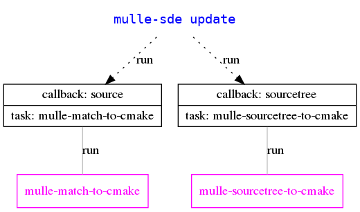
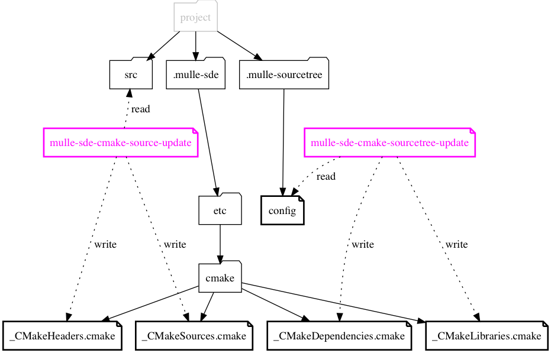

# 🏋🏼 mulle-sde, cmake support

This is a [mulle-sde](//github.com/mulle-sde/mulle-sde) *buildtool extension*
for the [cmake](//cmake.org) build-system.
It is generally installed as a dependency to a *meta extension* such as
[mulle-sde-cmake-c](//github.com/mulle-sde/mulle-sde-cmake-c), but it is usable
on its own.

This extension generates the cmake files that perform the `find_library`
calls to locate dependencies.

## Install

OS          | Command
------------|------------------------------------
macos       | `brew install mulle-kybernetik/software/mulle-sde-cmake`
other       | Install prerequisite [mulle-sde](//github.com/mulle-sde/mulle-sde) first. Then `./install.sh`


## mulle-sde integration

**mulle-sde** affects an *update* by calling the `source` and `sourcetree`
callbacks and executing the required tasks. These callbacks and tasks are when
choosing the *buildtool* extension `mulle-sde:cmake`.



The callbacks trigger the "cmake-source-update" and "cmake-sourcetree-update"
tasks. 

**cmake-source-update** will create the files `_CMakeHeaders.cmake`
and `_CMakeSources.cmake` from the examination of the `src` folder and its
subfolders according to the installed *patternfiles*.

**cmake-sourcetree-update** will create `_CMakeDependencies.cmake`
and `_CMakeLibraries.cmake` from the contents of the
[mulle-sourcetree](/mulle-sde/mulle-sourcetree).





## Customization

`cmake-source-update` will emit cmake definitions according to the
*patternfile* category. As an example:

Your *patternfile* is called `00-source--experimental`. All files matching
this *patternfile* will be emitted as:

```
set( EXPERIMENTAL
...
)
```
